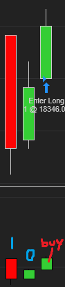

cum methods

		public Series<double> DeltaOpen

		public Series<double> DeltaHigh

		public Series<double> DeltaLow

		public Series<double> DeltaClose
		
https://ninjatrader.com/support/helpGuides/nt8//NT%20HelpGuide%20English.html?order_flow_cumulative_delta2.htm
- based on NT8's cum delta, but same methods but only BidAsk type.

How it works:
CumDelta val is always DeltaClose
For backtesting: Price is triggered two bars after confirming
For live: Price triggered after 1 bar as shown in pic below

